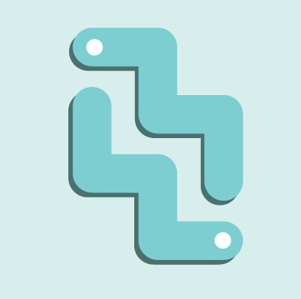

GOGO 
<div align="center">

</div>


 ## Service Description 
 **혼행족을 위한 여행 서비스입니다 ...ing**. 

 ## Using Tech
 - Spring Boot(Spring Security, JWT, JPA)
 - MySQLDB
 - AWS(EC2,RDS,S3) 


 ## API WIKI 
- [API 문서](https://github.com/Yboyu0u/GOGO_API/wiki)

## ERD (temporaily)


## Dependency
```
dependencies {
    implementation 'org.springframework.boot:spring-boot-starter-security'
    implementation 'org.springframework.boot:spring-boot-starter-validation'
    implementation 'org.springframework.boot:spring-boot-starter-web'
    implementation 'org.springframework.boot:spring-boot-starter-mail'
    implementation 'com.h2database:h2'
    implementation 'org.springframework.boot:spring-boot-starter-data-jpa'
    compile 'org.springframework.boot:spring-boot-starter-jdbc'
    compile 'mysql:mysql-connector-java'
    implementation 'org.projectlombok:lombok:1.18.16'
    implementation 'io.jsonwebtoken:jjwt-api:0.11.2'
    runtime 'io.jsonwebtoken:jjwt-impl:0.11.2'
    runtime 'io.jsonwebtoken:jjwt-jackson:0.11.2'
    compileOnly 'org.projectlombok:lombok'
    developmentOnly 'org.springframework.boot:spring-boot-devtools'
    annotationProcessor 'org.projectlombok:lombok'
    testImplementation 'org.springframework.boot:spring-boot-starter-test'
    testImplementation 'org.springframework.security:spring-security-test'
    testImplementation 'org.springframework.boot:spring-boot-starter-test'
    testImplementation 'org.junit.platform:junit-platform-launcher:1.5.0'
    testImplementation 'org.junit.jupiter:junit-jupiter-api:5.5.0'
    testImplementation 'org.junit.jupiter:junit-jupiter-engine:5.5.0'
    testImplementation 'org.mockito:mockito-junit-jupiter'
    implementation group: 'org.springframework.cloud', name: 'spring-cloud-starter-aws', version: '2.2.1.RELEASE'
}
```
